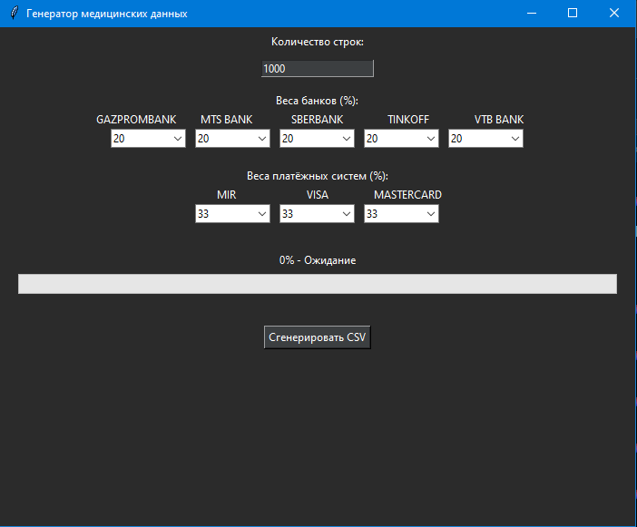

# Генерация синтетического датасета визитов в платную поликлинику

## Описание программы
Данная программа предназначена для генерации синтетического датасета, имитирующего данные о посещениях пациентов платной поликлиники. Генерируемый датасет содержит информацию о пациентах, их симптомах, посещениях врачей, проведенных анализах и оплате услуг. Программа предоставляет возможность гибкой настройки каждого свойства в соответствии с техническим заданием.



## Требования к системе
- **Python** 3.8 или выше
- Библиотеки, указанные в файле `requirements.txt`:
  - `pandas`
  - `numpy`
  - `faker` (с поддержкой ru_RU)
  - `tkinter` (для графического интерфейса, обычно входит в стандартную поставку Python)
  - `datetime`
  - `random`

## Техническое задание

### A. Сгенерировать датасет, в котором будут следующие наборы свойств:
1.  **ФИО** — Иванов Иван Иванович
2.  **Паспортные данные** — 1234 123456
3.  **СНИЛС** — 123-456-789 12
4.  **Симптомы** — боль в горле
5.  **Выбор врача** — лор
6.  **Дата посещения врача** — 2020-01-22T08:30+03:00
7.  **Анализы** — мазок на ковид
8.  **Дата получения анализов** — 2020-01-24T09:30+03:00
9.  **Стоимость анализов** — 2000 руб.
10. **Карта оплаты** — "1234 5678 1234 5678"

### B. Дополнительная информация по каждому свойству:
1.  **ФИО** — генерируется из словаря, состоящего только из славянских ФИО.
2.  **Паспортные данные** — уникальные значения для каждого пациента, соответствующие формату русских, белорусских или казахских паспортов.
3.  **СНИЛС** — уникальные значения, но привязанные к клиенту (ФИО и паспортные данные), которые могут повторяться при повторном посещении.
4.  **Симптомы** — генерируются из словаря возможных симптомов. Возможна комбинация до 10 симптомов в одной записи.
5.  **Выбор врача** — генерируется из словаря возможных специальностей врачей в поликлинике.
6.  **Дата посещения врача** — генерируется в рабочие дни и часы.
7.  **Анализы** — генерируются из словаря возможных анализов. Возможна комбинация до 5 анализов в одном назначении.
8.  **Дата получения анализов** — генерируется через 24-72 часа после посещения врача, в рабочие дни и часы.
9.  **Стоимость анализов** — свободная генерация данных в рублях.
10. **Карта оплаты** — предоставляет возможность настройки датасета: вероятность какого банка (Сбербанк и т.д.), через какую платежную систему (Visa, MasterCard, Мир) производится оплата. Оплачивать могут несколько раз с одной карты.

### C. Ограничения датасета:
1.  Всего строк в датасете — **минимум 50 000**.
2.  **ФИО** — словарь должен состоять только из славянских ФИО.
3.  **Паспортные данные** — только русские, белорусские и казахские паспорта.
4.  **СНИЛС** — уникален, но привязан к клиенту.
5.  **Симптомы** — словарь должен состоять минимум из **5000 симптомов** (возможна комбинация до 10 штук).
6.  **Выбор врача** — словарь должен состоять минимум из **50 специальностей врачей**.
7.  **Дата посещения врача** — в рабочие время и дни недели. Повторное посещение может быть к врачу минимально через 24 часа после получения анализов.
8.  **Анализы** — словарь должен состоять минимум из **250 анализов** (возможна комбинация до 5 штук).
9.  **Дата получения анализов** — в рабочие время и дни (через 24-72 часа).
10. **Стоимость анализов** — только в рублях.
11. **Карта оплаты** — максимальное количество повторов одной карты — **5 раз**.

## Установка и запуск

1.  Клонируйте репозиторий или скачайте исходный код.
2.  Установите необходимые зависимости:
    ```bash
    pip install -r requirements.txt
    ```
3.  Запустите программу:
    ```bash
    python main.py
    ```
4.  Следуйте инструкциям в графическом интерфейсе для настройки параметров генерации.

## Инструкция по использованию

1.  В интерфейсе программы можно выбрать параметры для генерации:
    *   Платежную систему (Visa, MasterCard, Мир) и банк-эмитент (Сбербанк, Тинькофф, ВТБ и др.)
    *   Количество записей для генерации (не менее 50 000)
2.  После выбора необходимых параметров нажмите кнопку **"Генерировать"**.
3.  Процесс генерации может занять некоторое время в зависимости от мощности вашего компьютера и требуемого размера датасета.
4.  По завершении работы программа сохранит данные в CSV-файл с указанием даты и времени создания в папке `output/`.

## Пример вывода (CSV файл)

| ФИО | Паспорт | СНИЛС | Симптомы | Врач | Дата_посещения | Анализы | Дата_анализов | Стоимость | Карта_оплаты |
| :--- | :--- | :--- | :--- | :--- | :--- | :--- | :--- | :--- | :--- |
| Петров Алексей Сергеевич | 4510 123456 | 112-233-445 95 | головная боль, температура | терапевт | 2023-11-15T09:15+03:00 | общий анализ крови | 2023-11-17T10:30+03:00 | 1500 | 2200 1234 5678 9012 |
| Сидорова Анна Владимировна | 75 12 345678 | 223-344-556 12 | кашель, насморк | лор | 2023-11-14T14:00+03:00 | мазок из зева, ПЦР-тест | 2023-11-16T16:45+03:00 | 3500 | 4111 1111 1111 1111 |

## Лицензия

Данная программа является открытой и доступна для свободного использования и модификации.